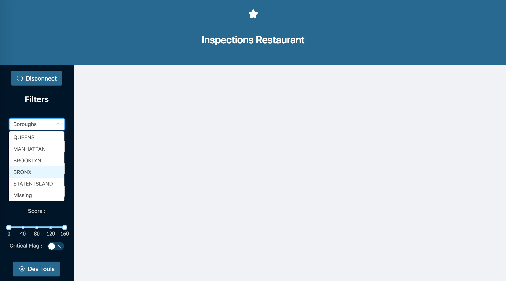

# Inspections Restaurant Web App

## Introduction

We have a dataset comprised of inspections of NYC restaurants. This WebApp allows you to find restaurants and their inspections based on some criteria such as the borough, the grade, the inspection code...

You can access the WebApp via the following link : [https://nyrestaurants.herokuapp.com/](https://nyrestaurants.herokuapp.com/)

Skip to the usage section in you don't want to install the application on your computer. Otherwise, follow the instructions in the installation section.

## Installation

If you don't have Node.js installed on your computer, you can download it [here](https://nodejs.org/en/).

Clone the project:
```sh
❯ git clone https://github.com/felixlarrouy/NoSQL_app.git
```

Install npm dependencies:
```sh
❯ npm install
```

Run the web application:
```sh
❯ npm start
```

## Usage

### Main page


You can select filters on the left side to display the corresponding restaurants.




When the table of restaurants is displayed, you can click on a restaurant (i.e row of the restaurant) to display all the inspections of this restaurant.


### Developer mode

You can choose which type of query you want to run :

* find


* aggregate


* distinct.


You can then type the parameters in the form(s) like you would do in a mongo IDE. The results will be displayed in a JSON.


